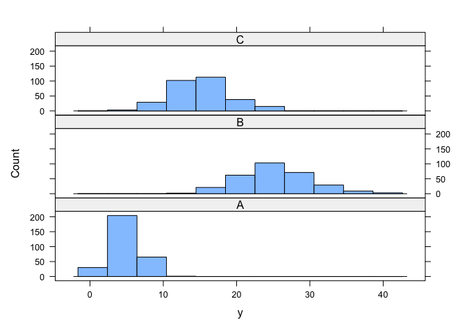

<!-- README.md is generated from README.Rmd. Please edit that file -->

# clubpro

An R package for *cl*assification *u*sing *b*inary *p*rocrustes
*ro*tation based on Grice (2011).

## Installation

Install the development version of `clubpro` from
[GitHub](https://github.com/timbeechey/clubpro) with:

``` r
# install.packages("remotes")
remotes::install_github("timbeechey/clubpro")
```

## Citation

To cite `clubpro` in your work you can use the output of:

``` r
citation(package = "clubpro")
```

## Background

`clubpro` is an implementation of methods described in [Grice
(2011)](https://psycnet.apa.org/record/2011-14580-000).

## using `clubpro`

``` r
library(clubpro)
library(lattice)
```

Simulate some count data.

``` r
set.seed(123)

n <- 300

dat <- data.frame(x = rep(c("A","B","C"), each = n),
                  y = c(rpois(n, lambda = 10),
                        rpois(n, lambda = 15),
                        rpois(n, lambda = 20)))

dat$x <- factor(dat$x)

histogram( ~ y | x, data = dat, layout = c(1,3))
```

<!-- -->

Run the model.

``` r
mod <- with(dat, club(y, x))
```

Print a summary of the model output (note: only the first 50 lines of
output are shown here).

``` r
summary(mod)
#> ********** Classification Results **********
#> Observations: 900 
#> Missing observations: 0 
#> Target groups: 3 
#> Correctly classified observations: 612 
#> Incorrectly classified observations: 288 
#> Ambiguously classified observations: 0 
#> PCC: 68 
#> 
#> ********** Randomisation Test **********
#> Random reorderings: 1000 
#> Minimum random PCC: 35.22 
#> Maximum random PCC: 44.78 
#> Chance-value: 0 
#> 
#>     individual observation target prediction  accuracy
#> 1            1           8      A          A   correct
#> 2            2           9      A          A   correct
#> 3            3          14      A          B incorrect
#> 4            4          10      A          A   correct
#> 5            5          10      A          A   correct
#> 6            6          15      A          B incorrect
#> 7            7          11      A          A   correct
#> 8            8           5      A          A   correct
#> 9            9           4      A          A   correct
#> 10          10          13      A          B incorrect
#> 11          11          11      A          A   correct
#> 12          12          11      A          A   correct
#> 13          13          10      A          A   correct
#> 14          14           8      A          A   correct
#> 15          15          15      A          B incorrect
#> 16          16          11      A          A   correct
#> 17          17           3      A          B incorrect
#> 18          18           7      A          A   correct
#> 19          19           6      A          A   correct
#> 20          20           8      A          A   correct
#> 21          21           6      A          A   correct
#> 22          22           8      A          A   correct
#> 23          23           4      A          A   correct
#> 24          24           6      A          A   correct
#> 25          25           6      A          A   correct
#> 26          26           8      A          A   correct
#> 27          27           5      A          A   correct
#> 28          28          12      A          B incorrect
#> 29          29          12      A          B incorrect
#> 30          30          12      A          B incorrect
#> 31          31          12      A          B incorrect
#> 32          32          11      A          A   correct
#> 33          33           9      A          A   correct
#> 34          34           9      A          A   correct
...
```

Plot the classification results.

``` r
plot(mod)
```

<!-- -->

# References

Grice, J. W. (2011). *Observation oriented modeling: Analysis of cause
in the behavioral sciences*. Academic Press.
