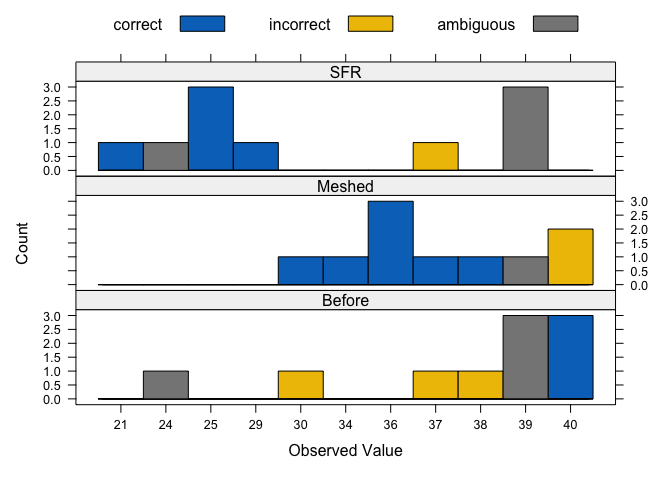

<!-- README.md is generated from README.Rmd. Please edit that file -->

# clubpro

An R package for *cl*assification *u*sing *b*inary *p*rocrustes
*ro*tation based on Grice (2011).

## Installation

Install the development version of `clubpro` from
[GitHub](https://github.com/timbeechey/clubpro) with:

``` r
# install.packages("remotes")
remotes::install_github("timbeechey/clubpro")
```

## Citation

To cite `clubpro` in your work you can use the output of:

``` r
citation(package = "clubpro")
```

## Background

`clubpro` is an implementation of methods described in [Grice
(2011)](https://psycnet.apa.org/record/2011-14580-000).

## using `clubpro`

``` r
library(clubpro)
library(lattice)
library(carData)
```

Load the `Friendly` dataset from the `carData` package.

``` r
data(Friendly, package = "carData")
dat <- Friendly
```

This data set consists of counts of correctly recalled words (out of 40)
across three experimental conditions.

``` r
str(dat)
#> 'data.frame':    30 obs. of  2 variables:
#>  $ condition: Factor w/ 3 levels "Before","Meshed",..: 3 3 3 3 3 3 3 3 3 3 ...
#>  $ correct  : int  39 25 37 25 29 39 21 39 24 25 ...
```

Run the model to quantify how well `condition` can be classified from
`correct`, the count of correctly recalled words.

``` r
mod <- with(dat, club(correct, condition, nreps = 1000))
```

Print a summary of the model output.

``` r
summary(mod)
#> ********** Classification Results **********
#> Observations: 30 
#> Missing observations: 0 
#> Target groups: 3 
#> Correctly classified observations: 15 
#> Incorrectly classified observations: 7 
#> Ambiguously classified observations: 8 
#> PCC: 50 
#> Median classification strength index: 0.74 
#> 
#> ********** Randomisation Test **********
#> Random reorderings: 1000 
#> Minimum random PCC: 20 
#> Maximum random PCC: 80 
#> Chance-value: 0.91 
#> 
#>    individual observation target prediction  accuracy  csi
#> 1           1          39    SFR Before|SFR ambiguous 0.68
#> 2           2          25    SFR        SFR   correct 1.00
#> 3           3          37    SFR     Meshed incorrect 0.62
#> 4           4          25    SFR        SFR   correct 1.00
#> 5           5          29    SFR        SFR   correct 1.00
#> 6           6          39    SFR Before|SFR ambiguous 0.68
#> 7           7          21    SFR        SFR   correct 1.00
#> 8           8          39    SFR Before|SFR ambiguous 0.68
#> 9           9          24    SFR Before|SFR ambiguous 0.71
#> 10         10          25    SFR        SFR   correct 1.00
#> 11         11          40 Before     Before   correct 0.80
#> 12         12          38 Before     Meshed incorrect 0.74
#> 13         13          39 Before Before|SFR ambiguous 0.68
#> 14         14          37 Before     Meshed incorrect 0.62
#> 15         15          39 Before Before|SFR ambiguous 0.68
#> 16         16          24 Before Before|SFR ambiguous 0.71
#> 17         17          30 Before     Meshed incorrect 0.74
#> 18         18          39 Before Before|SFR ambiguous 0.68
#> 19         19          40 Before     Before   correct 0.80
#> 20         20          40 Before     Before   correct 0.80
#> 21         21          40 Meshed     Before incorrect 0.80
#> 22         22          39 Meshed Before|SFR incorrect 0.68
#> 23         23          34 Meshed     Meshed   correct 1.00
#> 24         24          37 Meshed     Meshed   correct 0.62
#> 25         25          40 Meshed     Before incorrect 0.80
#> 26         26          36 Meshed     Meshed   correct 1.00
#> 27         27          36 Meshed     Meshed   correct 1.00
#> 28         28          38 Meshed     Meshed   correct 0.74
#> 29         29          36 Meshed     Meshed   correct 1.00
#> 30         30          30 Meshed     Meshed   correct 0.74
```

Plot the classification results.

``` r
plot(mod)
```

<!-- -->

# References

Grice, J. W. (2011). *Observation oriented modeling: Analysis of cause
in the behavioral sciences*. Academic Press.
